# go-memo 🧠

[](https://opensource.org/licenses/MIT)
[](https://go.dev/)
[](https://goreportcard.com/report/github.com/kamalyes/go-memo)
[](https://pkg.go.dev/github.com/kamalyes/go-memo)
[](https://github.com/kamalyes/go-memo/issues)
[](https://github.com/kamalyes/go-memo/stargazers)

**go-memo** 是一个高性能、零外部依赖的纯内存键值存储引擎，完全兼容 Redis RESP 协议——任何标准 Redis 客户端（`redis-cli`、go-redis、redigo，以及 RedisInsight / Another Redis Desktop Manager 等可视化面板）均可直接连接查看数据核心能力：256 分片懒删除内存存储、AOF 顺序追加 + RDB 周期快照、RESP 命令流主从复制与 epoch 选举防脑裂

## 为什么叫 memo

`memo` 取自 **memory（记忆）**，是希腊记忆女神 Mnemosyne 的短写本库是一个纯粹的内存存储引擎——数据像记忆一样瞬时读写；AOF/RDB 持久化让记忆可留存、可恢复；主从复制与自动选举让记忆可共享、可容灾一个短小但传神的词，恰如其分地概括了这个库的本质

## 🏗️ 系统架构

```mermaid
graph TB
    subgraph "客户端层 Redis 客户端"
        CLI["redis-cli"]
        GoRed["go-redis"]
        Panel["RedisInsight<br/>Another Redis Desktop Manager"]
    end

    subgraph "接入层 RESP 协议"
        Conn["server.Server<br/>连接读写循环<br/>每连接一个 goroutine"]
        Resp["resp 包<br/>流式解析 + 序列化<br/>零依赖 RESP 编解码"]
    end

    subgraph "命令层 Command Layer"
        Registry["command.Registry<br/>命令注册与分发"]
        StringCmd["字符串命令<br/>GET / SET / INCRBY"]
        KeyCmd["键命令<br/>DEL / EXPIRE / TTL<br/>SCAN / KEYS / TYPE"]
        SvrCmd["服务命令<br/>PING / SELECT / INFO<br/>DBSIZE"]
    end

    subgraph "存储层 Storage Layer"
        Memory["store.Memory<br/>256 分片无锁<br/>过期键懒删除"]
    end

    subgraph "持久化层 Persistence Layer"
        AOF[("AOF<br/>仅追加日志<br/>everysec 刷盘")]
        RDB[("RDB<br/>快照<br/>原子重命名")]
    end

    subgraph "复制层 Replication Layer"
        Master["Master<br/>副本登记与扇出"]
        Slave["Slave<br/>SYNC 全量 + 增量应用"]
        Election["Election<br/>epoch 选举防脑裂"]
    end

    %% 客户端接入
    CLI --> Conn
    GoRed --> Conn
    Panel -->|"RESP 直连查看数据"| Conn

    %% 接入到命令
    Conn --> Resp
    Resp --> Registry

    %% 命令分发到实现
    Registry --> StringCmd
    Registry --> KeyCmd
    Registry --> SvrCmd

    %% 命令落到存储
    StringCmd --> Memory
    KeyCmd --> Memory
    SvrCmd --> Memory

    %% 存储到持久化
    Memory -->|"Append"| AOF
    Memory -->|"Snapshot"| RDB

    %% 主从复制链
    Slave -->|"SYNC"| Master
    Master -->|"命令流扇出"| Slave
    Election -->|"晋升/抢占"| Master

    %% 样式定义
    classDef clientStyle fill:#e1f5fe,stroke:#01579b,stroke-width:2px
    classDef accessStyle fill:#fff9c4,stroke:#f57f17,stroke-width:2px
    classDef cmdStyle fill:#e8eaf6,stroke:#283593,stroke-width:2px
    classDef storeStyle fill:#e8f5e8,stroke:#1b5e20,stroke-width:2px
    classDef persistStyle fill:#fff3e0,stroke:#e65100,stroke-width:2px
    classDef replStyle fill:#f3e5f5,stroke:#4a148c,stroke-width:2px

    class CLI,GoRed,Panel clientStyle
    class Conn,Resp accessStyle
    class Registry,StringCmd,KeyCmd,SvrCmd cmdStyle
    class Memory storeStyle
    class AOF,RDB persistStyle
    class Master,Slave,Election replStyle
```



### 架构特点

- **一套 RESP 统一三件事**：客户端通信、AOF 持久化、主从复制共用同一套 RESP 编解码，保持协议层单一实现
- **零依赖**：仅使用 Go 标准库，无任何第三方依赖，可运行于任意 Go 1.20+ 环境
- **分片无锁**：256 分片 + 每分片 `RWMutex`，读写分散到独立锁降低争用，热路径 O(1)
- **过期懒删除**：键过期不主动扫描，访问时判断 `expireAt` 即时剔除，内存占用可控
- **高性能写路径**：AOF 顺序追加 + 后台 everysec 刷盘，RDB 读锁采集 + 临时文件原子 rename，不阻塞服务
- **主从复制**：master 扇出 RESP 命令流，slave `SYNC` 全量快照 + 增量应用，`*-1` 空数组作快照结束标记
- **自动选举**：静态优先级 + epoch 心跳抢占（3s×3 判死），epoch 单调递增防脑裂
- **可视化面板直连**：`INFO` 返回标准 `redis_version` 与 `# Keyspace`，`SCAN / KEYS / TYPE / DBSIZE` 支撑面板浏览键数据

## ✨ 核心特性

### 🎯 存储与命令

- **RESP 协议兼容**：`+`/`-`/`:`/`$`/`*` 五种类型完整编解码，与 Redis 客户端完全互通
- **分片内存存储**：FNV-1a 哈希分散到 256 个独立锁，并发读 + 串行写
- **过期键懒删除**：`expireAt` 到期访问即删，`TTL` 返回毫秒级存活时间
- **命令注册表**：命令名大小写不敏感，`Register` 可扩展自定义命令
- **键枚举**：`SCAN` 游标遍历 + `KEYS` 通配符匹配 + `TYPE` 类型查询 + `DBSIZE` 键计数

### 🏗️ 持久化

- **AOF**：RESP 命令原样顺序追加，`Append` 写路径 + `Sync` 显式刷盘 + 后台 everysec 协程
- **RDB**：读锁采集全量快照，写临时文件后原子 `rename`，`SNAPSHOT` 结束标记指引
- **回放**：`Replay` 顺序读取命令流逐条回放，启动重建或快照装载复用同一入口

### 🏢 复制与高可用

- **主从扇出**：master 登记副本，命令流批量扇出，写失败自动剔除
- **全量 + 增量同步**：`SYNC` 先发快照 + `*-1` 标记，其后增量命令流持续追加
- **自动选举**：静态优先级 + epoch 心跳抢占，3s×3 判死，epoch 防脑裂保障单一权威源

### 🛡️ 服务编排

- **每连接一个 goroutine**：独立读写循环，`bufio` 缓冲，优雅关闭等待在途连接退出
- **函数式选项**：`WithAddr` / `WithStore` 轻量装配，默认内存后端，可注入自定义存储

## 📦 安装

```bash
go get github.com/kamalyes/go-memo
```

## 🚀 快速开始

```go
package main

import (
	"log"

	"github.com/kamalyes/go-memo/server"
)

func main() {
	srv := server.New(server.WithAddr(":7399"))
	log.Printf("memo listening on %s", srv.Addr())
	if err := srv.ListenAndServe(); err != nil {
		log.Fatal(err)
	}
}
```

```bash
# 标准 redis-cli 直连
$ redis-cli -p 7399
127.0.0.1:7399> SET foo bar
OK
127.0.0.1:7399> GET foo
"bar"
127.0.0.1:7399> INCRBY cnt 10
(integer) 10
127.0.0.1:7399> DBSIZE
(integer) 2
127.0.0.1:7399> SCAN 0
1) "0"
2) 1) "foo"
   2) "cnt"
```

## 支持的命令

| 类别 | 命令 |
| --- | --- |
| 服务 | `PING` / `SELECT` / `INFO` |
| 键操作 | `DEL` / `EXPIRE` / `PEXPIRE` / `TTL` / `PTTL` |
| 键枚举 | `DBSIZE` / `SCAN` / `KEYS` / `TYPE` |
| 字符串 | `SET` / `GET` / `INCRBY` |

## 📦 模块分层

| 包 | 职责 |
| --- | --- |
| [resp](./resp) | RESP 协议编解码：流式读取、响应序列化、命令序列化，零依赖 |
| [store](./store) | 分片内存 KV：256 分片无锁、过期键懒删除、快照采集与键枚举 |
| [command](./command) | 命令实现：注册表与分发、字符串/键/服务命令、通配符匹配 |
| [server](./server) | 服务编排：连接读写循环、优雅关闭、函数式选项装配 |
| [persistence](./persistence) | 持久化：AOF 顺序追加回放、RDB 快照保存装载 |
| [replication](./replication) | 复制与选举：master 扇出、slave 同步、epoch 选举状态机 |
| [bootstrap](./bootstrap) | 可执行入口：flag 解析 + 信号优雅关闭 |

## 目录结构

```
go-memo/
├── resp/            # RESP 协议编解码（零依赖）
├── store/           # 分片无锁内存 KV + 过期键懒删除
├── command/         # 命令注册表与命令实现
├── server/          # 连接读写循环与服务编排
├── persistence/     # AOF + RDB 持久化
├── replication/     # 主从复制 + 选举
└── bootstrap/       # 可执行入口
```

## � 性能基准

go-memo 以「高性能、零依赖」为首要目标，核心设计面向高并发读写：

- **分片锁**：256 分片各自持独立 `RWMutex`，读并发无阻塞、写仅锁住命中的分片
- **热路径 O(1)**：键经 FNV-1a 哈希直接定位分片，命令分发为哈希表查询
- **懒删除**：过期键访问时即时剔除，无后台扫描任务占用 CPU
- **零依赖**：纯标准库实现，无第三方运行时开销

> 完整 benchmark（吞吐 / p99 延迟，与原生 Redis 对照）计划放入独立仓库 `go-memo-benchmark` 后续补全

## �📄 许可证

[MIT](./LICENSE) © 2023 kamalyes